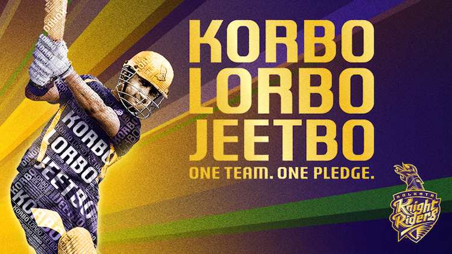

# Group 60 - Thalla

## **Milestones**

Details for Milestone are available on Canvas (left sidebar, Course Project).

 

## **Describe your topic/interest in about 150-200 words**

Our group's interest in analyzing data from the Indian Premiere League (IPL) stems from our shared passion for cricket. As cricket fans since childhood, we have grown up watching and following the sport, and the IPL has become a significant event in the cricketing calendar over the last decade.

By analyzing the data from the IPL, we hope to gain a deeper understanding of the players who have excelled in the tournament over the years. This analysis will help us identify the top 11 players who have consistently performed well and made a significant impact in the tournament.

We believe that this analysis will not only enhance our knowledge of the game, but it will also provide insights into the strategies employed by successful teams and players. Moreover, the IPL has become a platform for young players to showcase their talent, and by studying the data, we can gain an understanding of the trends and patterns of player development in the tournament.

Overall, our group is excited to work on this project as it combines our passion for cricket with our analytical skills.

 

 

## **Describe your dataset in about 150-200 words**
The dataset was provided by Vora1011 (Sahil Vora), an independent contributor on Kaggle. The dataset contains a comprehensive collection of data from all IPL matches played from 2008 to 2022.

The dataset has been updated regularly and has been made publicly available for educational and research purposes. The data was collected over a period of 14 years, starting from 2008 when the Indian Premier League was first introduced. The purpose of this dataset is to provide a comprehensive and detailed account of all the IPL matches played up to 2022. The dataset includes a wealth of information about the performance of players, teams, and tournaments, which can be used for research, analysis, and predictions. The data can also be used to identify trends and patterns in the performance of players and teams, and to gain insights into the strategies and tactics employed by successful teams and players.

The data has been collected through a combination of manual data entry and automated data collection methods. Sahil Vora states that integral data was sourced from ESPNCricInfo and Cricsheet. To minimize the chances of human and computer errors, the data has been cross-verified with other sources and has undergone a validation process.

 

## **Team Members**

- Ojus Sharma: Definitely not a Dhoni fan.
- Ishaan Solanki: Definitely not a fan of the best team in the IPL.
- Sparsh Khanna : Definitely a KL Rahul fan.

## Images

## Top 4 Batsmen:

## Top 4 Bowlers:

## Best Wicketkeeper and Top 2 Allrounders:

## References

Credit for all images goes to Tata IPL

