## **DATA301: Introduction to Data Analytics**
---
---
### **Cumulative Report for Course Project** 
### **Group 60**

---
### **INTRODUCTION:**  

Cricket is one of the most popular sports in the world, with millions of fans and players worldwide. The Indian Premier League (IPL) is a professional Twenty20 cricket league in India that has gained tremendous popularity since its inception in 2008. The league has seen some of the world's best cricketers showcasing their skills and talents, and the competition has been intense year after year. As a cricket enthusiasts, we were intrigued by the IPL dataset and wanted to explore it further to find the best eleven players of all time.

The dataset contains a wealth of information, including player details, match statistics, ball by ball stats, and more, spanning from 2008 to 2022. By analyzing this data, we can gain insights into player and team performances, identify trends, and make data-driven decisions about which players should be included in the best eleven.As we delve deeper into the dataset, we will explore various factors that affect player and team performances, such as batting and bowling averages, strike rates, economy rates, and more. 

Overall, the IPL dataset presents a unique opportunity to explore the world of cricket and analyze the performances of some of the best cricketers in the world. By using data analysis techniques, we can identify the best eleven players and gain a deeper understanding of what makes them stand out from the rest.

## **EXPLORATORY DATA ANALYSIS:**   

### ***TOP BATSMEN***

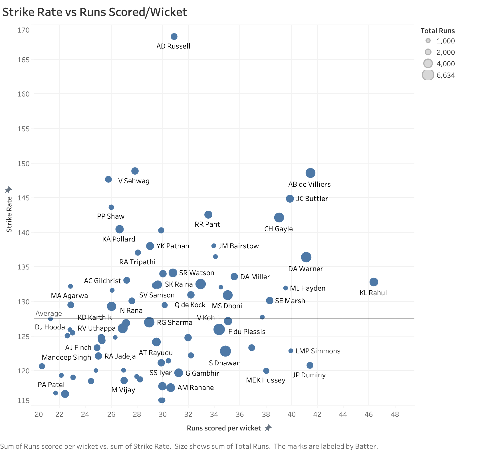
*Figure 1: The graph above is for Batsmen and is a scatter plot of Strike Rate (Runs scored per 100 balls) vs Batting Average (Runs Scored/Wicket) and the size of the data point is thier Career Runs Scored.* 

**This graph gives information about what a good Strike Rate and Batting Average is supposed to be and gives us a rough idea about players in contention for the best IX.**

  

### ***TOP BOWLERS***

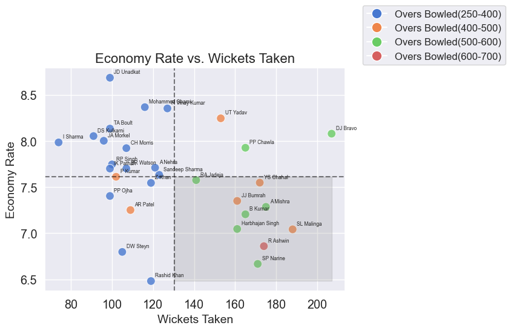
*Figure 2: This graph is for Bowlers and is a scatter plot of Economy Rate (Runs conceded per over) vs Wickets Taken and the colour denotes the overs bowled.*  

**The bottom right quadrant is the most ideal place for the Bowlers to be. As it exhibits longevity with high quality of bowling.**

  

### ***TOP WICKETKEEPERS***

*Figure 3.1: The graph is for wicketkeeprs and displays the statistics of necessary quantitatives of a Wicketkeeper.*
  

* **The graphs show that some keepers (MS Dhoni, KD Karthik) have extremely high values for Stumpings and Total Dismissals due to their longevity in the game. On the other hand, some keepers have a higher strike rate and are exceptional batsmen, which is an important quality for wicketkeepers (ex. AB de Villiers, RR Pant)**

  

### ***TOP ALL ROUNDERS***
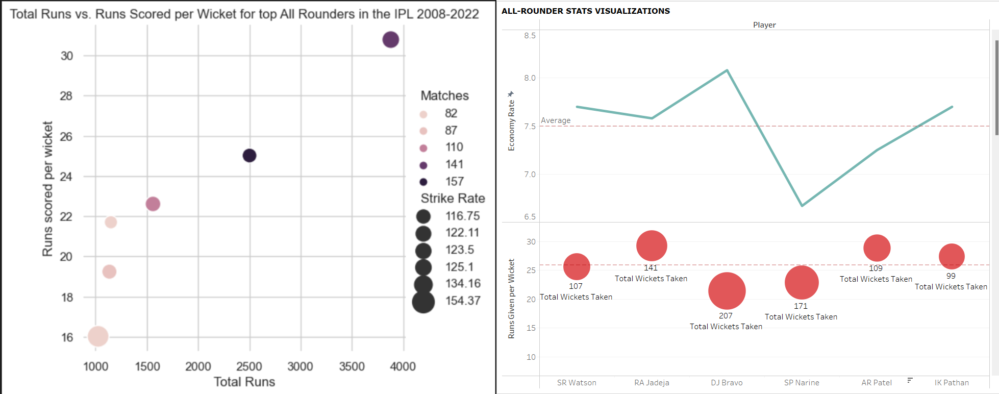
*Figure 3.2: The graphs show the important statistics that are considered to check the mettle of a top All Rounder in IPL.*
  

* **From the first visualization, we see that SR Watson seems to be in a league of his own. R Jadeja is the only player close to him**
* **From the second visualization, we see that DJ Bravo has high wickets and Economy. While Narine has low wickets and low economy**
* **The other All Rounders are somewhat simmilar in bowling statistics, showing us the somewhat expected statistics of a top All Rounder**

  

---
# **INDIVIDUAL RESEARCH QUETIONS**
## Ishaan Solanki
### **RESEARCH QUESTION ONE:**  
**Who are the top 4 IPL Batsmen of all time?** 
 
In order to answer this question, we need to consider the situations where Batsmen score runs for example, Playoffs or while chasing and we need to know the variables to consider when making a  Weighted Score (Score based on perfomance). 

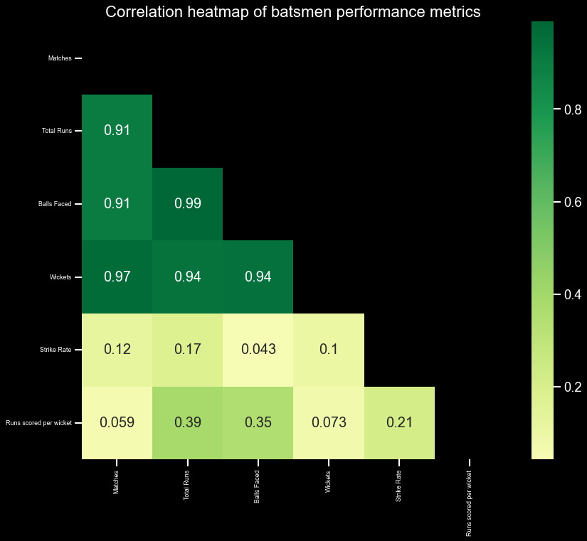
Figure 4: This is a Correlation Heatmap of all the metrics of a Batting stats. 

The most important thing for Batsmen is to score runs. You can see form this graph that Runs is strongly correlated to wickets, that means scoring more runs increases the likelihood of getting out. Hence, it maked Batting Average a really good metric to judge batsmen perfomrance. Strike Rate is rate at which batsmen score runs and shouldn't be affected at all by the number of matches a person plays, but in this case matches has a weak correlation with stike rate, concluding that more expierenced player tent to have higher strike rate not only that Total runs also has a weak correlation with Strike Rate so ,indeed, Strike Rate is another metric needed to find out the best batsmnen.

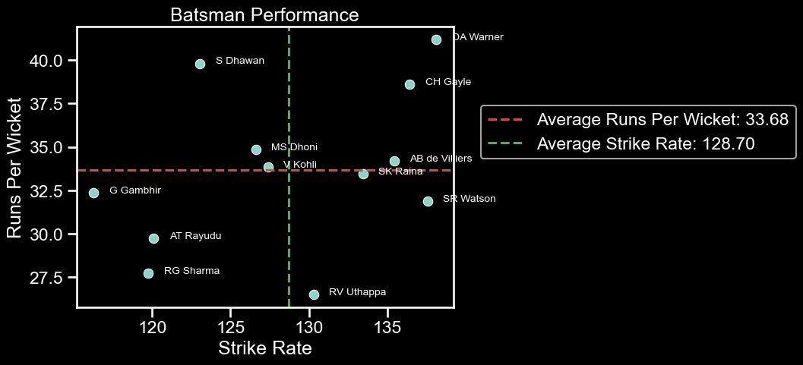
Figure 5: This is a scatterplot of Batting Average vs Strike Rate while Chasing.  

You can compare this graph to the first graph in EDA and see that players perform differently when under pressure, hence its very important to take into consideration all situations. That's why I have given certain percentages of weigthed score to every situation: Overall (60%), Playoffs (20%) and while Chasing (20%).

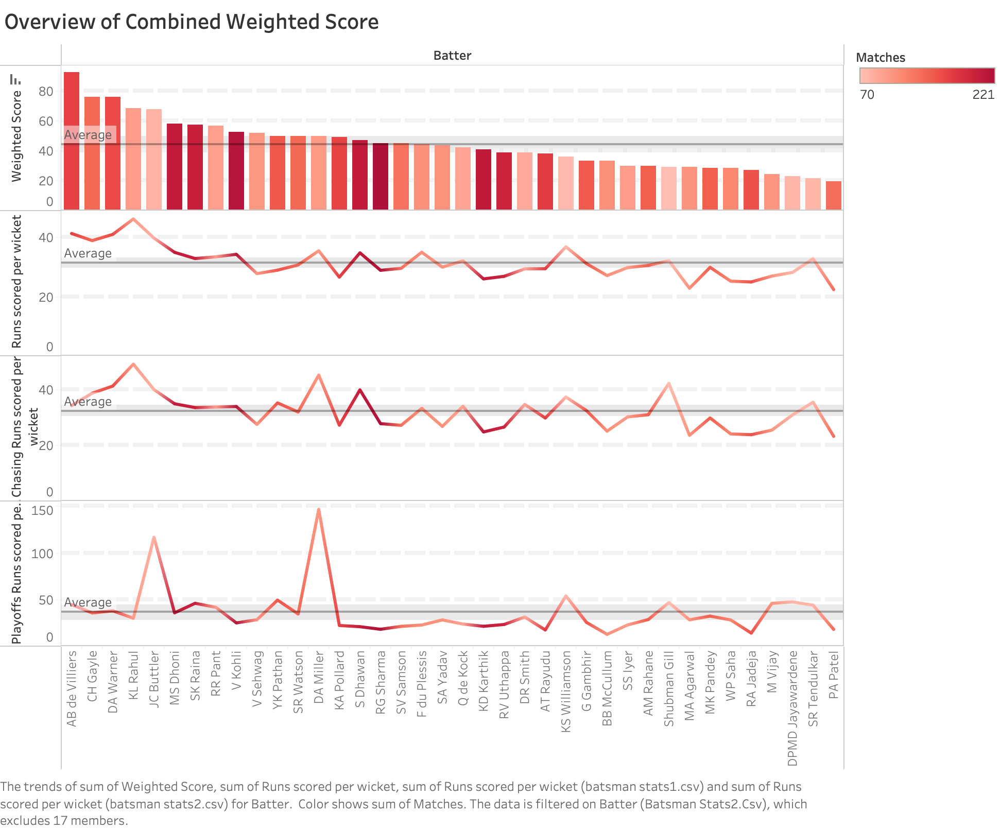
The above graph gives an overview of Combined Weighted Score.  

Firstly, I made a weigthed score which directly propotional to Batting Average, Strike Rate and Matches played. Then I applied to this formula to all situations. Then I added up my weigthed score across all datsaframes to get this bar chart. From this, I can conclude that these are the top 4 best batsmen in the history of IPL: 
1. AB de Villiers
2. CH Gayle
3. DA Warner
4. KL Rahul

---
## Sparsh Khanna
### **RESEARCH QUESTION TWO :**  

**Who are the all time  top 4 IPL bowlers?**

The Indian Premier League (IPL) has seen many great bowlers over the years, but who are the all-time top 4? To answer this question, I assessed several key statistics, including the number of wickets taken, overs bowled, extras bowled, wickets per over, and economy rate. I Further divided these metrics into three segments All time stats from-regular season(60%), playoff season(20%) and deathovers(20%)By analyzing these metrics and assigning weighted scores we were able to identify the top 4 IPL bowlers of all time.

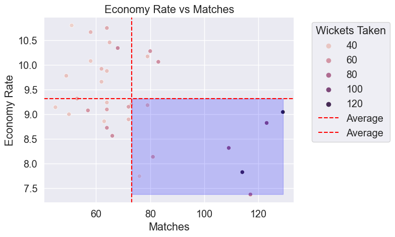

**Figure 6.1: The above graph Economy rate vs. Matches in Death Overs is the plot presented above.**

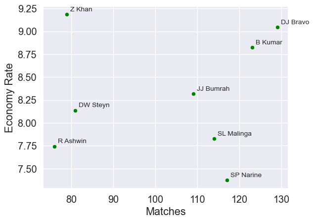

**Figure 6.2: The above graph Economy rate vs. Matches in Death Overs is the plot presented above but this plot shows a closer look at the fourth quadrant of Figure 6.1 which is the region where the bowlers should ideally be.**

It is filtered to only show bowlers with 35 or more wickets.
We can observe that bowlers who have bowled in more than average matches typically have low economies, which suggests that **economies play a significant role in determining how well a bowler performs in death overs.**
You can see that the impact on economy is negligible. For instance, a bowler with around 80 matches has a very low economy and takes very few wickets, whereas a bowler with about the same number of matches has a high economy and takes more wickets. On the graph, you can also see oppositional examples to this.
Consequently, it can be said that getting wickets has no impact on a bowler's economy rate.

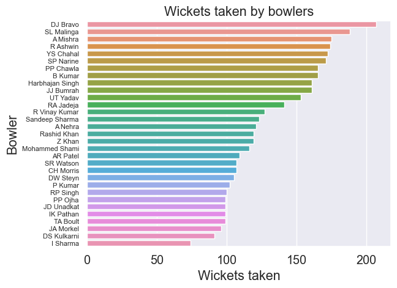

**Figure 7.1: Bar Plot for wickets taken by bowlers.**

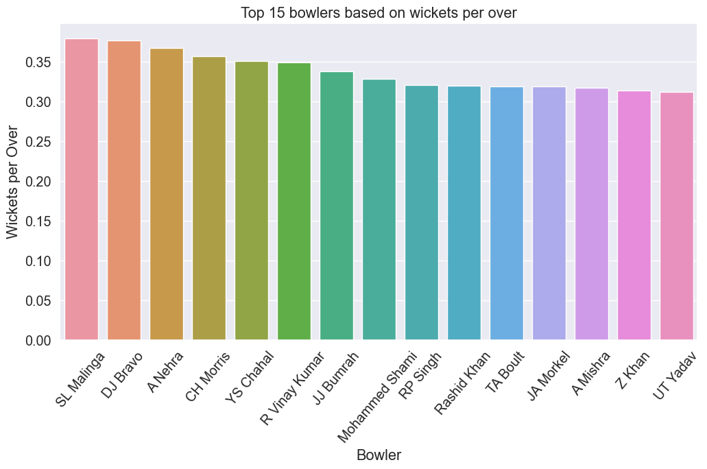

**Figure 7.2: Bar Plot for wicket taking ability of bowlers , or simply Wickets per over.**

The first statistic everybody considers or brings up when discussing whether a bowler is good or poor is how many wickets a bowler has taken. A bowler who collects 100 wickets in 50 overs is a better wicket taker than a bowler who takes 200 wickets in 180 overs, even though we are considering the number of wickets a player has taken as a key metric. The graphs above  put that fact into perspective and demonstrates which bowlers are actually thought to be extremely aggressive and lethal.So taking this statistic into account is important.

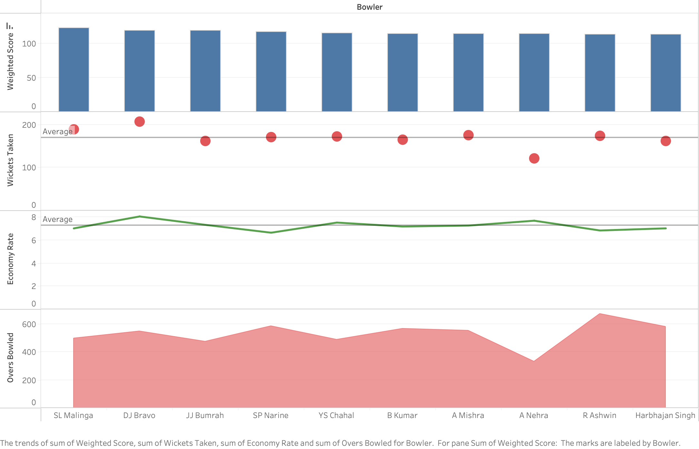

The following graphic combines the bowlers' final weighted scores, total wickets taken, economy rates, and total number of overs bowled—all important statistics or primary statistics that contribute to the case for the best 4 bowlers in IPL history.The weighted score was calculated around these statistics to give the top 4 as :
1. **SL Malinga**
2. **DJ Bravo**
3. **JJ Bumrah**
4. **SP Narine**

---
 

## Ojus Sharma
### **RESEARCH QUESTION THREE-A :**  

> #### **Who is the Best Wicketkeeper in IPL History?**
 

***Introduction*** \
Wicketkeeping is a crucial aspect of cricket, and a skilled wicketkeeper can have a significant impact on the outcome of a match. A wicketkeeper's primary role is to catch the ball when a batsman is dismissed or when a bowler delivers a ball that the batsman fails to hit. Additionally, wicketkeepers are responsible for stumping, run-outs, and other important fielding tasks. In the context of the Indian Premier League (IPL), finding the best wicketkeeper requires a careful analysis of various statistics. My Weighted Score formula takes into account a wicketkeeper's catches, stumpings, dismissals per innings, runs per wicket, and strike rate to arrive at an overall score. By using this formula, we can identify the most effective wicketkeepers in IPL history.

 

### **Most Dismissals and Stumpings**
In cricket, wicketkeepers play a crucial role in the fielding team. The number of dismissals and stumpings by a wicketkeeper is a reflection of their skills and ability to affect the outcome of the game. Having a high number of dismissals and stumpings can indicate the wicketkeeper's ability to read the game, react quickly, and make important contributions to their team's success.

 

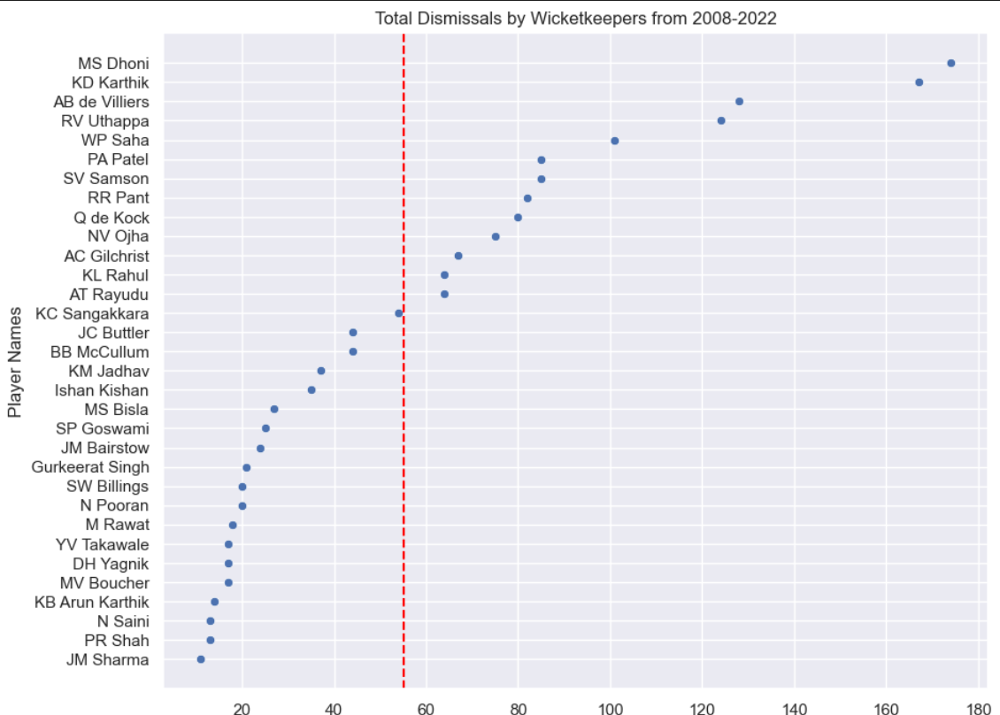
*Figure 3.A.1: Scatterplot of Total Dismissals by Keepers with more than 10 Dismissals in IPL History*

 

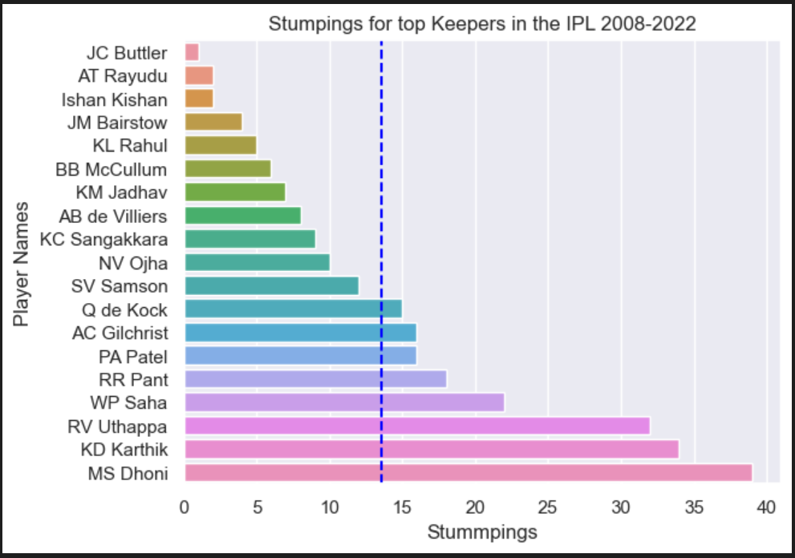
*Figure 3.A.2: Barplot of Total Stumpings by Keepers in IPL History*

From the above two graphs, we clearly see that ***MS Dhoni and DK Karthik have the most stumpings and total dismissals***. These 2 players have been playing the sport for a very long time and have had an immense effect on the IPL. It is important to note that longevity in the game plays a huge role in the weighted score of each player.

 

### **Highest Strike Rate and Runs Scored Per Wicket**
In the fast-paced and highly competitive game of IPL, a wicketkeeper's performance with the bat can make a crucial difference in the team's success. A high strike rate and runs scored per wicket indicates that the wicketkeeper not only provides stability to the batting order but can also score quickly when required, making them a valuable asset to any team.

 

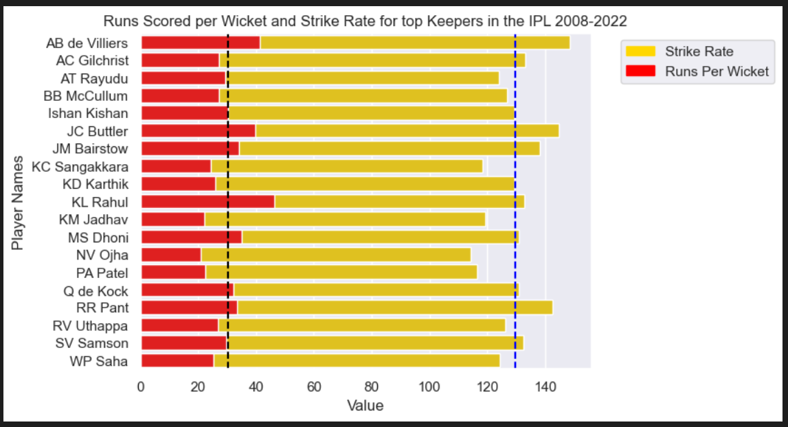
*Figure 3.A.3: Barplot of Strike Rate and Runs Scored per Wicket in the IPL by Wicketkeepers*

**AB de Villiers has the highest Strike Rate of all Wicketkeepers, while KL Rahul has the highest Runs scored per ball**. RR Pant, Q de Cock, MS Dhoni, KL Rahul, J Butler, J Barstow have AB de Villiers are the only players that have both metrics above the average value.

 

### **Final Weighted Score**
The weighted score formula for finding the best wicketkeeper in IPL history considers five key performance metrics: catches, stumpings, dismissals per innings, runs per wicket, and strike rate. The formula assigns weights to each metric, with catches and stumpings each accounting for 15% of the score, dismissals per innings and runs per wicket accounting for 30% and 20%, respectively, and the remaining 20% being based on strike rate. ***To ensure that longevity is seriously considered, only wicketkeepers with more than 60 innings were considered.***

 

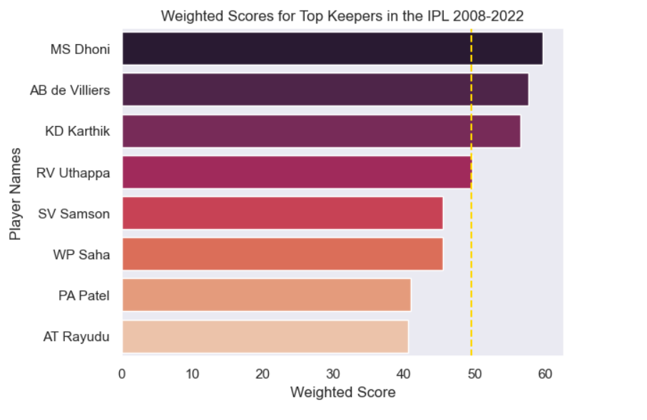
*Figure 3.A.3: Barplot of Weighted Score per Wicket in the IPL by Wicketkeepers*

From the above graphs and the ultimate weighted score visualization, we can see that:
> ### **MS DHONI IS THE BEST WICKETKEEPER IN IPL HISTORY**
 

---
 

### **RESEARCH QUESTION THREE-B :**  

> #### **Who are the Best All-Rounders in IPL History?**
 

***Introduction*** \
All-rounders are an integral part of any cricket team as they possess a unique combination of batting, bowling, and fielding skills. They not only provide balance to the team but also play a crucial role in the outcome of the game. In the context of IPL, the significance of all-rounders becomes even more pronounced as they bring depth and versatility to the team. To determine the best all-rounders in IPL history, a weighted score formula has been proposed which takes into account the total runs scored, total wickets taken, economy rate, strike rate, and the number of matches played by the players. This formula aims to provide a comprehensive evaluation of the players and identify the most impactful all-rounders in IPL history.

 

### **Batting Strike Rate, Runs Scored Per Wicket & Total Runs**
For all-rounders in IPL, having a high strike rate and runs per wicket are essential to contribute significantly with the bat. Total runs scored show consistency over multiple seasons. These stats are critical in determining the best batting all-rounder as they reflect the player's ability to both score runs and take wickets consistently, adding value to the team.

 

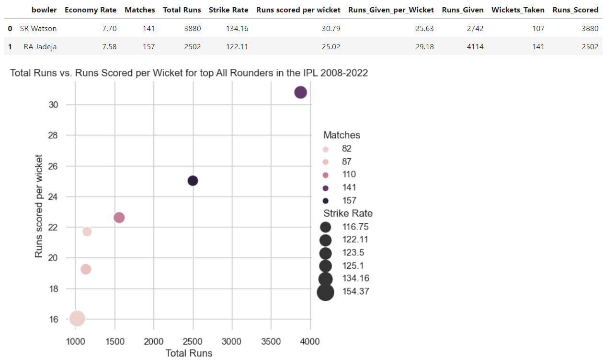
*Figure 3.B.1: Scatterplot with Weighted Marks of Batting Stats of Top All Rounders in IPL History*

From the above two graphs, we clearly see that ***SR Watson has the most Runs Scored per Wicket, most Total Runs and 2nd most Strike Rate***. ***SR Narine has the highest Strike Rate.*** There is no clear competition in batting averages. It is important to note that Jadeja is second.

 

### **Bowling Economy Rate and Wickets Taken**
To be considered the best, all-rounders must have a low economy rate as it indicates their ability to restrict the opposition's scoring rate. Additionally, high wickets taken demonstrates their proficiency in taking crucial wickets at important moments in the game, which can be the difference between winning and losing. These stats are crucial in deciding who is the best bowling all-rounder in IPL history as they reflect the impact a player has had on the team's success.

 

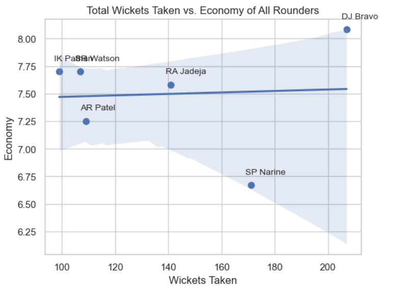
*Figure 3.B.2: Barplot of Strike Rate and Runs Scored per Wicket in the IPL by Wicketkeepers*

**DJ Bravo has the highest Total Wickets Taken while SP Narine has the Lowest Economy Rate**. 

 

### **Final Weighted Scores**
Two Weighted Scores are generated. One for Batting based All Rounder and one for Bowling based All Rounder.
>Batting All Rounder \
Weighted_Score_Batting= \
['Runs_Given_per_Wicket']*0.15 + \
['Runs_Scored']*0.025 + \
['Economy Rate']*0.15 + \
['Strike Rate']*0.20 + \
['Runs scored per wicket']*0.20 + \
['Matches']*0.05

>Bowling All Rounder \
Weighted_Score_Batting= \
['Runs_Given_per_Wicket']*0.2 + \
['Wickets Taken']*0.25 + \
['Economy Rate']*0.2 + \
['Strike Rate']*0.15 + \
['Runs scored per wicket']*0.15 + \
['Matches']*0.05

The metrics used in the formula are important for assessing the all-round performance of players in IPL history. Runs given per wicket, economy rate, and strike rate are key measures of a bowler's effectiveness, while runs scored and runs scored per wicket are important for batting. The formula assigns weights to each metric to determine a weighted score for each player, with higher scores indicating better all-round performance. The percentages used in the formula indicate the relative importance of each metric, with some metrics given greater weight than others.

 

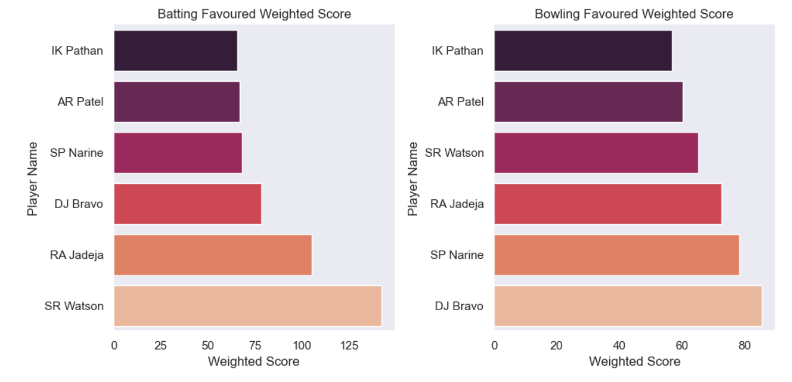
*Figure 3.A.3: Barplot of Weighted Score per Top All Rounder in the IPL*

From the above graphs and the ultimate weighted score visualization, we can see that:
> ### **SR WATSON IS THE BEST BATTING ALL ROUNDER**
> ### **DJ BRAVO IS THE BEST BOWLING ALL ROUNDER** 

 

---

 

---
 

## **BEST 11 IN IPL HISTORY:**  

***BATSMEN***
1. **AB de Villiers**
2. **CH Gayle**
3. **DA Warner**
4. **KL Rahul**

***BOWLERS***
1. **SL Malinga**
2. **DJ Bravo**
3. **JJ Bumrah**
4. **SP Narine**

***ALL ROUNDERS***
1. **SR WATSON**
2. **DJ BRAVO**

***WICKETKEEPER***
1. **MS DHONI (Captain)**