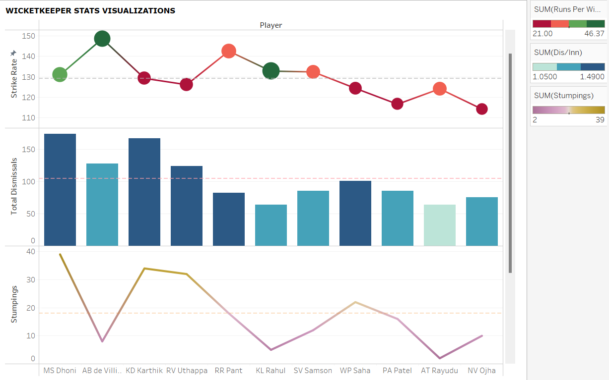

## **DATA301: Introduction to Data Analytics**
---
---
### **Cumulative Report for Course Project** 
### **Group 60**

---
### **INTRODUCTION:**  

Cricket is one of the most popular sports in the world, with millions of fans and players worldwide. The Indian Premier League (IPL) is a professional Twenty20 cricket league in India that has gained tremendous popularity since its inception in 2008. The league has seen some of the world's best cricketers showcasing their skills and talents, and the competition has been intense year after year. As a cricket enthusiasts, we were intrigued by the IPL dataset and wanted to explore it further to find the best eleven players of all time.

The dataset contains a wealth of information, including player details, match statistics, ball by ball stats, and more, spanning from 2008 to 2020. By analyzing this data, we can gain insights into player and team performances, identify trends, and make data-driven decisions about which players should be included in the best eleven.As we delve deeper into the dataset, we will explore various factors that affect player and team performances, such as batting and bowling averages, strike rates, economy rates, and more. 

Overall, the IPL dataset presents a unique opportunity to explore the world of cricket and analyze the performances of some of the best cricketers in the world. By using data analysis techniques, we can identify the best eleven players and gain a deeper understanding of what makes them stand out from the rest.

### **EXPLORATORY DATA ANALYSIS:**   

Figure 1: The graph above is for Batsmen and is a scatter plot of Strike Rate (Runs scored per 100 balls) vs Batting Average (Runs Scored/Wicket) and the size of the data point is thier Career Runs Scored. 
This graph gives information about what a good Strike Rate and Batting Average is supposed to be and gives us a rough idea about players in contention for the best IX.

Figure 2: This graph is for Bowlers and is a scatter plot of Economy Rate (Runs conceded per over) vs Wickets Taken and the colour denotes the overs bowled.  
The bottom right quadrant is the most ideal place for the Bowlers to be. 

Figure 3: The graph is for wicketkeeprs and displays thier Batting Performance Value based on Strike Rate and Batting Average.   
You can see from the graph the best batting wicketkeepers.

---
## Ishaan Solanki
### **RESEARCH QUESTION ONE:**  
**Who are the top 4 IPL Batsmen of all time?** 
 
In order to answer this question, we need to consider the situations where Batsmen score runs for example, Playoffs or while chasing and we need to know the variables to consider when making a  Weighted Score (Score based on perfomance). 

Figure 4: This is a Correlation Heatmap of all the metrics of a Batting stats. 

The most important thing for Batsmen is to score runs. You can see form this graph that Runs is strongly correlated to wickets, that means scoring more runs increases the likelihood of getting out. Hence, it maked Batting Average a really good metric to judge batsmen perfomrance. Strike Rate is rate at which batsmen score runs and shouldn't be affected at all by the number of matches a person plays, but in this case matches has a weak correlation with stike rate, concluding that more expierenced player tent to have higher strike rate not only that Total runs also has a weak correlation with Strike Rate so ,indeed, Strike Rate is another metric needed to find out the best batsmnen.

Figure 5: This is a scatterplot of Batting Average vs Strike Rate while Chasing.  

You can compare this graph to the first graph in EDA and see that players perform differently when under pressure, hence its very important to take into consideration all situations. That's why I have given certain percentages of weigthed score to every situation: Overall (60%), Playoffs (20%) and while Chasing (20%).

The above graph gives an overview of Combined Weighted Score.  

Firstly, I made a weigthed score which directly propotional to Batting Average, Strike Rate and Matches played. Then I applied to this formula to all situations. Then I added up my weigthed score across all datsaframes to get this bar chart. From this, I can conclude that these are the top 4 best batsmen in the history of IPL: 
1. AB de Villiers
2. CH Gayle
3. DA Warner
4. KL Rahul

---
## Sparsh Khanna
### **RESEARCH QUESTION TWO :**  

**Who are the all time  top 4 IPL bowlers?**

The Indian Premier League (IPL) has seen many great bowlers over the years, but who are the all-time top 4? To answer this question, I assessed several key statistics, including the number of wickets taken, overs bowled, extras bowled, wickets per over, and economy rate. I Further divided these metrics into three segments All time stats from-regular season(60%), playoff season(20%) and deathovers(20%)By analyzing these metrics and assigning weighted scores we were able to identify the top 4 IPL bowlers of all time.

**Figure 6.1: The above graph Economy rate vs. Matches in Death Overs is the plot presented above.**

**Figure 6.2: The above graph Economy rate vs. Matches in Death Overs is the plot presented above but this plot shows a closer look at the fourth quadrant of Figure 6.1 which is the region where the bowlers should ideally be.**

It is filtered to only show bowlers with 35 or more wickets.
We can observe that bowlers who have bowled in more than average matches typically have low economies, which suggests that **economies play a significant role in determining how well a bowler performs in death overs.**
You can see that the impact on economy is negligible. For instance, a bowler with around 80 matches has a very low economy and takes very few wickets, whereas a bowler with about the same number of matches has a high economy and takes more wickets. On the graph, you can also see oppositional examples to this.
Consequently, it can be said that getting wickets has no impact on a bowler's economy rate.

**Figure 7.1: Bar Plot for wickets taken by bowlers.**

**Figure 7.2: Bar Plot for wicket taking ability of bowlers , or simply Wickets per over.**

The first statistic everybody considers or brings up when discussing whether a bowler is good or poor is how many wickets a bowler has taken. A bowler who collects 100 wickets in 50 overs is a better wicket taker than a bowler who takes 200 wickets in 180 overs, even though we are considering the number of wickets a player has taken as a key metric. The graphs above  put that fact into perspective and demonstrates which bowlers are actually thought to be extremely aggressive and lethal.So taking this statistic into account is important.

The following graphic combines the bowlers' final weighted scores, total wickets taken, economy rates, and total number of overs bowled—all important statistics or primary statistics that contribute to the case for the best 4 bowlers in IPL history.The weighted score was calculated around these statistics to give the top 4 as :
1. **SL Malinga**
2. **DJ Bravo**
3. **JJ Bumrah**
4. **SP Narine**

