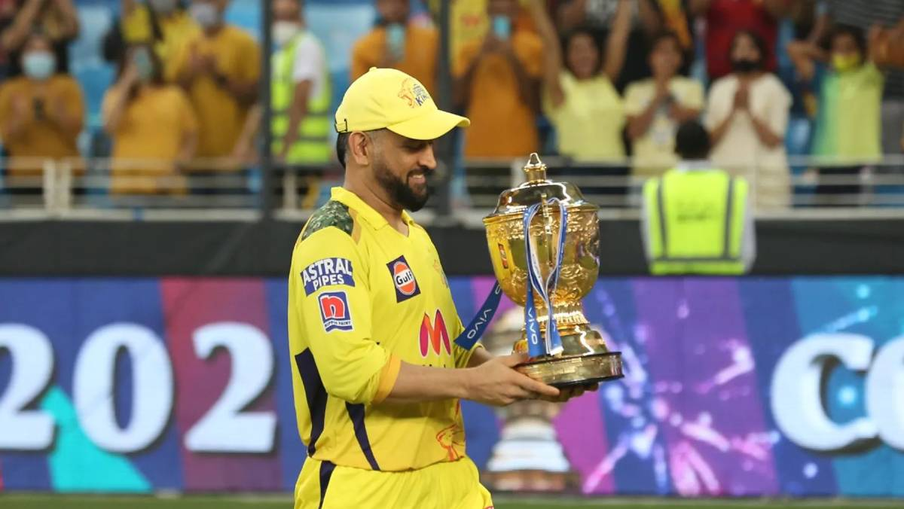

# Project Vision for Group 60

## ***I***
Through the use of data-driven techniques, our project vision is to **provide meaningful and insightful analysis of Indian Premiere League (IPL) cricket matches**. \
Our team aims to bring a fresh perspective to cricket. We aspire to **uncover patterns and trends in cricket matches**
 that were previously unknown to us, and the general public.

## ***II***
As cricket enthusiats, we are committed to provide an elaborate and accurate conclusion for the following:
> What is the best possible team of 11 players in the history of the IPL?

## ***III***
 We have planned to gather and analyze data from a wide range of sources, including match statistics, player performance, and other relevant information. To draw meaningful conclusions from the data, we will use statistical models and data visualization tools.

## ***IV***
On a larger scale, our project will hold the potential to contribute significantly to the field of cricket analysis and increase our understanding of the game.  At the end of the day, our goal is to bring the power of data and analytics to the world of cricket and drive it forward.

## Contracted Grade

For this project, we agree to contract for a A+.
